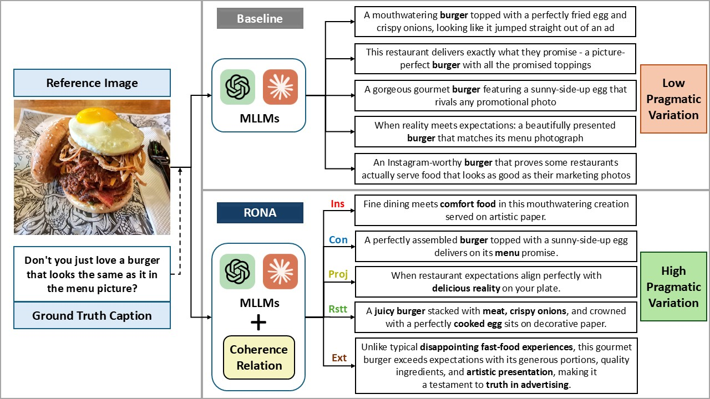

# RONA: Pragmatically Diverse Image Captioning with Coherence Relations

[Aashish Anantha Ramakrishnan](https://aashish2000.github.io), [Aadarsh Anantha Ramakrishnan](https://www.linkedin.com/in/aadarsh-a/), [Dongwon Lee](https://scholar.google.com/citations?user=MzL-WnEAAAAJ&hl=en)

Accepted in the [In2Writing Workshop](https://in2writing.glitch.me/), co-located with NAACL 2025.

## TL;DR

We propose RONA, a Coherence Relation-based pragmatic prompting strategy for MLLMs. Our approach generates pragmatically diverse captions, improving over existing baselines that only focus on syntax and semantic variations. 

## Code
Coming soon!